# Nama: Muhammad Rizky Al Farabi
# Nim: 2110131310007

# BIG JAVA

## 1.1 Program Komputer

Anda mungkin pernah menggunakan komputer untuk bekerja atau bersenang-senang. Banyak orang menggunakan komputer untuk
tugas sehari-hari seperti perbankan elektronik atau menulis makalah. Komputer adalah
baik untuk tugas-tugas seperti itu. Mereka dapat menangani tugas yang berulang, seperti menjumlahkan angka
atau menempatkan kata-kata di halaman, tanpa bosan atau lelah.
Fleksibilitas komputer adalah fenomena yang cukup menakjubkan. Mesin yang sama
dapat menyeimbangkan buku cek Anda, menyusun makalah Anda, dan bermain game. Sebaliknya,
mesin lain melakukan berbagai tugas yang jauh lebih sempit; sebuah mobil drive dan pemanggang roti
bersulang. Komputer dapat melakukan berbagai tugas karena mereka mengeksekusi berbeda
program, yang masing-masing mengarahkan komputer untuk mengerjakan tugas tertentu.
Komputer itu sendiri adalah mesin yang menyimpan data (angka, kata, gambar), berinteraksi dengan perangkat (monitor, sound system, printer), dan menjalankan program.
Sebuah program komputer memberitahu komputer, secara rinci, urutan langkah-langkah yang
dibutuhkan untuk memenuhi suatu tugas. Komputer fisik dan perangkat periferal secara kolektif disebut perangkat keras. Program yang dijalankan komputer disebut
perangkat lunak.
Program komputer saat ini sangat canggih sehingga sulit dipercaya bahwa mereka
terdiri dari instruksi yang sangat primitif. Instruksi tipikal mungkin satu
dari berikut ini:

• Letakkan titik merah pada posisi layar tertentu.

• Jumlahkan dua angka.

• Jika nilai ini negatif, lanjutkan program pada instruksi tertentu.

Pengguna komputer memiliki ilusi interaksi yang lancar karena sebuah program berisi
sejumlah besar instruksi seperti itu, dan karena komputer dapat mengeksekusinya di
kecepatan tinggi.
Tindakan merancang dan mengimplementasikan program komputer disebut program ming. Dalam buku ini, Anda akan mempelajari cara memprogram komputer—yaitu, cara mengarahkan
komputer untuk menjalankan tugas.
Untuk menulis game komputer dengan efek gerakan dan suara atau pengolah kata
yang mendukung font dan gambar mewah adalah tugas kompleks yang membutuhkan tim yang terdiri dari banyak orang
programmer yang sangat terampil. Upaya pemrograman pertama Anda akan lebih biasa.
Konsep dan keterampilan yang Anda pelajari dalam buku ini membentuk landasan penting, dan
Anda tidak perlu kecewa jika program pertama Anda tidak menyaingi kecanggihannya
perangkat lunak yang akrab bagi Anda. Sebenarnya, Anda akan menemukan bahwa ada sensasi yang luar biasa
bahkan dalam tugas pemrograman sederhana. Sungguh pengalaman yang luar biasa melihat komputer tepat dan cepat melakukan tugas yang akan membuat Anda menghabiskan waktu berjam-jam, untuk
membuat perubahan kecil dalam program yang mengarah pada perbaikan segera, dan untuk melihat
komputer menjadi perpanjangan dari kekuatan mental Anda.

## 1.2 Anatomi Komputer

Untuk memahami proses pemrograman, Anda harus memiliki pemahaman dasar tentang blok bangunan yang membentuk komputer. Kami akan melihat secara pribadi
komputer. Komputer yang lebih besar memiliki komponen yang lebih cepat, lebih besar, atau lebih kuat, tetapi
mereka pada dasarnya memiliki desain yang sama.
Di jantung komputer terletak pusatnya
unit pemrosesan (CPU) (lihat Gambar 1). Bagian dalam
pengkabelan CPU sangat rumit.
Misalnya, prosesor Intel Core (yang populer
CPU untuk komputer pribadi pada saat ini
tulisan) terdiri dari beberapa ratus juta
elemen struktural, yang disebut transistor.
CPU melakukan kontrol program dan data
pengolahan. Artinya, CPU menempatkan dan exe memotong instruksi program; itu melaksanakan
operasi aritmatika seperti penambahan, pengurangan, perkalian, dan pembagian; itu mengambil data
dari memori eksternal atau perangkat dan tempat
data yang telah diproses ke dalam penyimpanan.

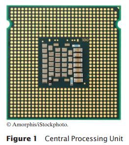

Ada dua macam penyimpanan. Usia penyimpanan primer, atau memori, dibuat dari sirkuit elektronik yang dapat menyimpan data, asalkan:
disuplai dengan tenaga listrik. Penyimpanan sekunder, biasanya hard disk (lihat Gambar 2)
atau solid-state drive, menyediakan penyimpanan yang lebih lambat dan lebih murah yang bertahan tanpa
listrik. Sebuah hard disk terdiri dari piringan berputar, yang dilapisi dengan magnet.

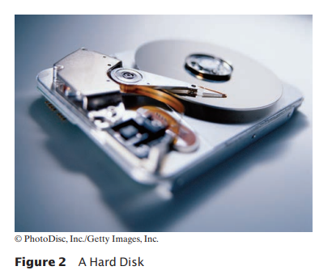

bahan. Solid-state drive menggunakan komponen elektronik yang dapat menyimpan informasi
tanpa daya, dan tanpa bagian yang bergerak.
Untuk berinteraksi dengan pengguna manusia, komputer membutuhkan perangkat periferal. Komputer mentransmisikan informasi (disebut output) kepada pengguna melalui layar tampilan,
speaker, dan printer. Pengguna dapat memasukkan informasi (disebut input) untuk komputer
dengan menggunakan keyboard atau alat penunjuk seperti mouse.
Beberapa komputer adalah unit mandiri, sedangkan yang lain saling berhubungan
melalui jaringan. Melalui kabel jaringan, komputer dapat membaca data dan
program dari lokasi penyimpanan pusat atau mengirim data ke komputer lain. Untuk pengguna
dari komputer jaringan, bahkan mungkin tidak jelas data mana yang berada di komputer itu sendiri dan mana yang ditransmisikan melalui jaringan.
Gambar 3 memberikan gambaran skematis arsitektur komputer pribadi.
Instruksi dan data program (seperti teks, angka, audio, atau video) berada di penyimpanan sekunder atau di tempat lain di jaringan. Ketika sebuah program dijalankan, instruksinya dibawa ke memori, di mana CPU dapat membacanya. CPU membaca dan
mengeksekusi satu instruksi pada suatu waktu. Seperti yang diarahkan oleh instruksi ini, CPU membaca
data, memodifikasinya, dan menulisnya kembali ke memori atau penyimpanan sekunder. Beberapa program
instruksi akan menyebabkan CPU menempatkan titik-titik pada layar tampilan atau printer atau ke
getarkan speakernya. Karena tindakan ini terjadi berkali-kali dan dengan kecepatan tinggi,
pengguna manusia akan melihat gambar dan suara. Beberapa instruksi program membaca pengguna
masukan dari keyboard, mouse, sensor sentuh, atau mikrofon. Program menganalisis sifat input ini dan kemudian mengeksekusi instruksi yang sesuai berikutnya.

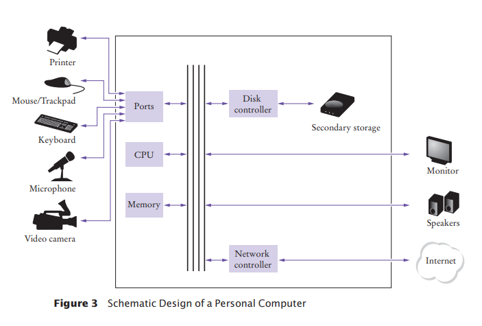

Ketika komputer
pertama kali ditemukan di
1940-an, komputer memenuhi seluruh
kamar. Foto di bawah ini menunjukkan
ENIAC (integrator numerik elektronik
dan komputer), selesai pada tahun 1946 di
Universitas Pennsylvania. Itu
ENIAC digunakan oleh militer untuk
menghitung lintasan peluru.
Saat ini, fasilitas komputasi
mesin pencari, toko internet, dan
jejaring sosial memenuhi gedung-gedung besar
disebut pusat data. Di ujung lain
spektrum, komputer ada di mana-mana
kita. Ponsel Anda memiliki komputer
di dalam, seperti halnya banyak kartu kredit dan ongkos
kartu untuk angkutan umum. Sebuah mobil modern
memiliki beberapa komputer––untuk mengontrol
mesin, rem, lampu, dan radio.
Munculnya komputasi di mana-mana berubah
banyak aspek dari kami
hidup. Pabrik digunakan
mempekerjakan orang untuk
lakukan perakitan berulang
tugas yang saat ini dilakukan oleh robot yang dikendalikan komputer, dioperasikan oleh beberapa orang
siapa yang tahu caranya
bekerja dengan mereka com puters. Buku, musik,
dan film saat ini
sering dikonsumsi
di komputer, dan
komputer hampir
selalu terlibat dalam produksi mereka.
Buku yang Anda baca benar
sekarang tidak dapat ditulis tanpa komputer.

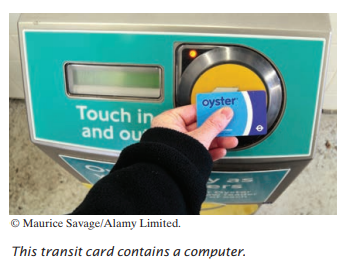

Mengetahui tentang komputer dan
bagaimana memprogramnya telah menjadi
keterampilan penting dalam banyak karir. Para insinyur merancang mobil yang dikendalikan komputer
dan peralatan medis yang melestarikan
hidup. Ilmuwan komputer mengembangkan
program yang membantu orang datang
bersama-sama untuk mendukung tujuan sosial. Untuk
misalnya, para aktivis menggunakan jejaring sosial untuk membagikan video yang menunjukkan pelecehan
oleh rezim represif, dan informasi ini berperan penting dalam mengubah
opini publik.
Sebagai komputer, besar dan kecil,
menjadi semakin tertanam dalam
kehidupan kita sehari-hari, semakin meningkat
penting untuk dipahami semua orang
bagaimana mereka bekerja, dan bagaimana bekerja dengan
mereka. Saat Anda menggunakan buku ini untuk belajar
cara memprogram komputer, Anda akan
mengembangkan pemahaman yang baik tentang dasar-dasar komputasi yang akan membuat
Anda warga negara yang lebih berpengetahuan dan, mungkin, seorang profesional komputasi.

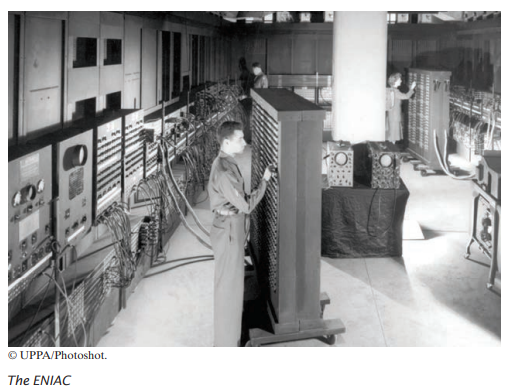

## 1.3 Bahasa Pemrograman Java
Untuk menulis program komputer, Anda perlu memberikan urutan instruksi
yang dapat dijalankan oleh CPU. Sebuah program komputer terdiri dari sejumlah besar
instruksi CPU, dan itu membosankan dan rawan kesalahan untuk menentukannya satu per satu. Untuk
Oleh karena itu, bahasa pemrograman tingkat tinggi telah dibuat. Dalam tingkat tinggi bahasa, Anda menentukan tindakan yang harus dilakukan program Anda. Kompilator
menerjemahkan instruksi tingkat tinggi ke dalam instruksi yang lebih rinci (disebut
kode mesin) yang dibutuhkan oleh CPU. Banyak bahasa pemrograman yang berbeda memiliki
telah dirancang untuk tujuan yang berbeda.
Pada tahun 1991, sebuah kelompok yang dipimpin oleh James Gosling dan Patrick
Naughton di Sun Microsystems merancang bahasa pemrograman, dengan kode nama "Green", untuk digunakan di perangkat konsumen, seperti televisi cerdas "set-top"
kotak. Bahasa dirancang agar sederhana, aman,
dan dapat digunakan untuk berbagai jenis prosesor. Tidak ada pelanggan yang pernah ditemukan untuk teknologi ini.
Gosling menceritakan bahwa pada tahun 1994 tim menyadari,
“Kita bisa menulis browser yang sangat keren. Itu adalah salah satu dari
beberapa hal dalam arus utama klien/server yang diperlukan
beberapa hal aneh yang telah kami lakukan: arsitektur netral, real-time, andal, aman.” Java diperkenalkan ke
kerumunan antusias di pameran SunWorld di
1995, bersama dengan browser yang menjalankan applet—Java
kode yang dapat ditemukan di mana saja di Internet.
Gambar di sebelah kanan menunjukkan contoh khas dari
apel.

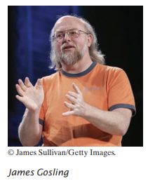

Sejak saat itu, Java tumbuh dengan kecepatan yang fenomenal.
Pemrogram telah memeluk bahasa ini karena
lebih mudah digunakan daripada saingan terdekatnya, C++. Selain itu, Java memiliki perpustakaan yang kaya yang memungkinkan
untuk menulis program portabel yang dapat melewati sistem operasi pro-prietary—fitur yang
dicari dengan penuh semangat oleh mereka yang ingin menjadi independen dari sistem berpemilik tersebut dan sedikit diperjuangkan oleh vendor mereka. Sebuah "edisi mikro"
dan "edisi perusahaan" dari perpustakaan Java
memungkinkan pemrogram Java untuk menargetkan perangkat keras mulai dari kartu pintar hingga yang terbesar
server internet.

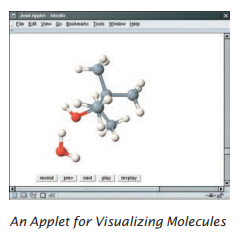

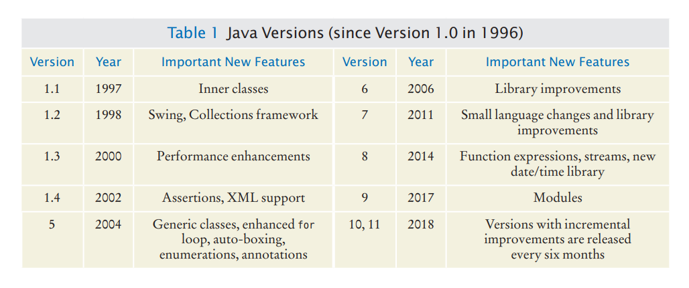

Karena Java dirancang untuk Internet, ia memiliki dua atribut yang membuatnya sangat
cocok untuk pemula: keamanan dan portabilitas.
Java dirancang agar siapa pun dapat menjalankan program di browser mereka tanpa
takut. Fitur keamanan bahasa Java memastikan bahwa suatu program dihentikan jika:
mencoba melakukan sesuatu yang tidak aman. Memiliki lingkungan yang aman juga bermanfaat bagi siapa saja
belajar bahasa java. Saat Anda membuat kesalahan yang mengakibatkan perilaku tidak aman, program Anda
dihentikan dan Anda menerima laporan kesalahan yang akurat.
Manfaat lain dari Java adalah portabilitas. Program Java yang sama akan berjalan, tanpa
ubah, di Windows, UNIX, Linux, atau Macintosh. Untuk mencapai portabilitas,
compiler Java tidak menerjemahkan program Java secara langsung ke dalam instruksi CPU.
Sebagai gantinya, program Java yang dikompilasi berisi instruksi untuk mesin virtual Java, a
program yang mensimulasikan CPU nyata. Portabilitas adalah manfaat lain untuk awal ning
murid. Anda tidak perlu belajar bagaimana menulis program untuk platform yang berbeda.
Saat ini, Java telah ditetapkan sebagai salah satu bahasa yang paling penting untuk
pemrograman tujuan umum serta untuk instruksi ilmu komputer. Namun,
meskipun Java adalah bahasa yang baik untuk pemula, itu tidak sempurna, karena tiga alasan.
Karena Java tidak dirancang khusus untuk siswa, tidak ada pemikiran yang diberikan untuk
membuatnya sangat sederhana untuk menulis program dasar. Sejumlah mesin teknis tertentu diperlukan untuk menulis bahkan program yang paling sederhana. Ini bukan masalah bagi pemrogram profesional, tetapi dapat menjadi gangguan bagi siswa pemula. Saat Anda mempelajari caranya
untuk memprogram di Java, akan ada saatnya Anda akan diminta untuk puas dengan
penjelasan awal dan menunggu detail yang lebih lengkap di bab selanjutnya.
Java telah diperpanjang berkali-kali selama hidupnya—lihat Tabel 1. Dalam buku ini, kami
asumsikan Anda memiliki Java versi 8 atau lebih baru.
Akhirnya, Anda tidak dapat berharap untuk mempelajari semua bahasa Java dalam satu kursus. Bahasa Java itu sendiri
relatif sederhana, tetapi Java berisi sekumpulan besar paket perpustakaan yang diperlukan untuk
menulis program yang bermanfaat. Ada paket untuk grafik, desain antarmuka pengguna, kriptografi, jaringan, suara, penyimpanan basis data, dan banyak tujuan lainnya. Bahkan
programmer Java ahli tidak dapat berharap untuk mengetahui isi dari semua paket—
mereka hanya menggunakan yang mereka butuhkan untuk proyek tertentu.
Dengan menggunakan buku ini, Anda diharapkan dapat belajar banyak tentang bahasa Java
dan tentang paket yang paling penting. Ingatlah bahwa tujuan utama dari ini
Buku itu bukan untuk membuatmu menghafalkan hal-hal kecil Java, tapi untuk mengajarimu cara berpikir
tentang pemrograman.

## 1.4 Menjadi Familiar dengan AndaLingkungan Pemrograman 

Banyak siswa menemukan bahwa alat yang mereka butuhkan sebagai programmer sangat berbeda dari
perangkat lunak yang mereka kenal. Anda harus meluangkan waktu untuk membuat diri Anda sendiri
akrab dengan lingkungan pemrograman Anda. Karena sistem komputer sangat bervariasi,
buku ini hanya dapat memberikan garis besar langkah-langkah yang perlu Anda ikuti. Ini adalah ide yang baik untuk
berpartisipasi dalam lab langsung, atau meminta teman yang berpengetahuan luas untuk memberi Anda tur.

Langkah 1 Mulai lingkungan pengembangan Java.

Sistem komputer sangat berbeda dalam hal ini. Pada banyak komputer terdapat lingkungan pengembangan terpadu di mana Anda dapat menulis dan menguji program Anda.

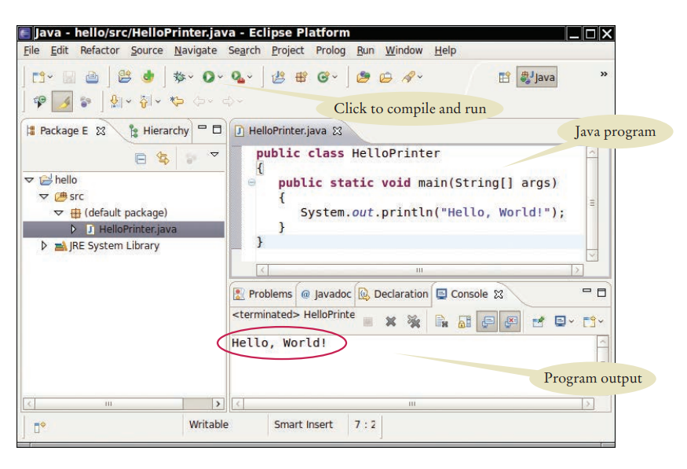

Di komputer lain Anda pertama kali meluncurkan editor, program yang berfungsi seperti kata
prosesor, di mana Anda dapat memasukkan instruksi Java Anda; Anda kemudian membuka konsol
jendela dan ketik perintah untuk menjalankan program Anda. Anda perlu mencari tahu caranya
memulai dengan lingkungan Anda.

Langkah 2 Tulis program sederhana.

Pilihan tradisional untuk program pertama dalam bahasa pemrograman baru adalah
sebuah program yang menampilkan sapaan sederhana: “Halo, Dunia!”. Mari kita ikuti tradisi itu. Inilah "Halo, Dunia!" program di Java:

public class HelloPrinter
{

 public static void main(String[] args)
 {

 System.out.println("Halo, Dunia!");
 }
}

Kami akan memeriksa program ini di bagian selanjutnya.
Apa pun lingkungan pemrograman yang Anda gunakan, Anda memulai aktivitas dengan
mengetik pernyataan program ke dalam jendela editor.
Buat file baru dan beri nama HelloPrinter.java, menggunakan langkah-langkah yang sesuai
untuk lingkungan Anda. (Jika lingkungan Anda mengharuskan Anda memberikan nama proyek
selain nama file, gunakan nama hello untuk proyek tersebut.) Masuk ke program
instruksi persis seperti yang diberikan di atas. Atau, cari salinan elektroniknya
dalam kode pendamping buku ini dan tempelkan ke editor Anda.
Saat Anda menulis program ini, perhatikan baik-baik berbagai simbol, dan simpan
mengingat bahwa Java peka huruf besar-kecil. Anda harus memasukkan huruf besar dan kecil dengan tepat
seperti yang muncul dalam daftar program. Anda tidak dapat mengetik MAIN atau PrintLn. Jika Anda tidak
hati-hati, Anda akan mengalami masalah—lihat Kesalahan Umum 1.2.

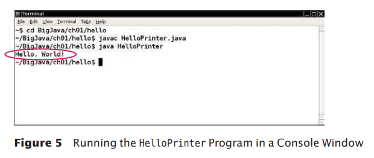

Langkah 3 Jalankan programnya.

Proses untuk menjalankan program sangat bergantung pada lingkungan pemrograman Anda. Anda mungkin harus mengklik tombol atau memasukkan beberapa perintah. Saat Anda menjalankan
program uji, pesannya

Halo Dunia!

akan muncul di suatu tempat di layar (lihat Gambar 4 dan Gambar 5).
Untuk menjalankan program Anda, kompiler Java menerjemahkan file sumber Anda (yang
adalah, pernyataan yang Anda tulis) ke dalam file kelas. (File kelas berisi instruksi untuk
mesin virtual Java.) Setelah kompiler menerjemahkan kode sumber Anda ke dalam
instruksi mesin virtual, mesin virtual mengeksekusinya. Selama eksekusi,
mesin virtual mengakses perpustakaan kode pra-tertulis, termasuk implementasi kelas System dan PrintStream yang diperlukan untuk menampilkan
keluaran program. Gambar 6 merangkum proses membuat dan menjalankan Java
program. Di beberapa lingkungan pemrograman, kompiler dan mesin virtual adalah
pada dasarnya tidak terlihat oleh programmer — mereka secara otomatis dieksekusi kapan saja
Anda meminta untuk menjalankan program Java. Di lingkungan lain, Anda perlu meluncurkan kompiler dan mesin virtual secara eksplisit.

Langkah 4 Atur pekerjaan Anda.

Sebagai seorang programmer, Anda menulis program, mencobanya, dan memperbaikinya. Anda menyimpan
program Anda dalam file. File disimpan dalam folder atau direktori. Sebuah folder dapat berisi

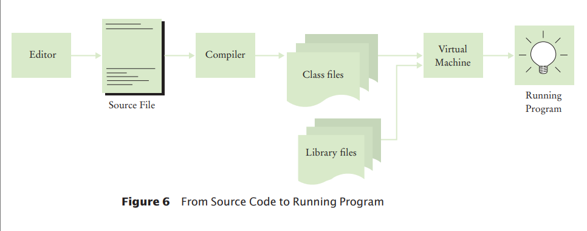

file serta folder lain, yang dengan sendirinya dapat berisi lebih banyak file dan folder (lihat
Gambar 7). Hirarki ini bisa sangat besar, dan Anda tidak perlu khawatir dengan semuanya
cabang-cabangnya. Namun, Anda harus membuat folder untuk mengatur pekerjaan Anda. Ini adalah sebuah
ide bagus untuk membuat folder terpisah untuk kursus pemrograman Anda. Di dalam folder itu, buat
folder terpisah untuk setiap program.
Beberapa lingkungan pemrograman menempatkan
program ke lokasi default jika Anda tidak menentukan folder sendiri. Dalam hal ini, Anda perlu menemukan
di mana file-file itu berada.
Pastikan Anda memahami di mana file Anda berada
terletak di hierarki folder. Informasi ini adalah
penting saat Anda mengirimkan file untuk dinilai, dan untuk
membuat salinan cadangan (lihat Tip Pemrograman 1.1).

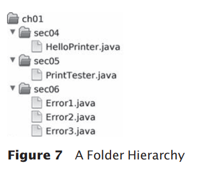

#### Salinan Cadangan

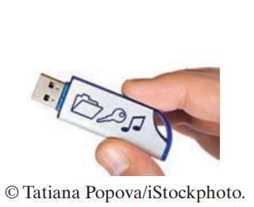)

Anda akan menghabiskan banyak waktu untuk membuat dan meningkatkan program Java.
Sangat mudah untuk menghapus file secara tidak sengaja, dan terkadang file hilang
karena kerusakan komputer. Mengetik ulang konten yang hilang
file membuat frustrasi dan memakan waktu. Oleh karena itu sangat penting
penting bagi Anda untuk mempelajari cara melindungi file dan membiasakannya
melakukannya sebelum bencana terjadi. Mencadangkan file di memori
stick adalah metode penyimpanan yang mudah dan nyaman bagi banyak orang. Lain yang semakin populer
bentuk cadangan adalah penyimpanan file Internet.
Berikut adalah beberapa petunjuk yang perlu diingat:

• Sering-seringlah membuat cadangan. Mencadangkan file hanya membutuhkan beberapa detik, dan Anda akan membenci diri sendiri jika Anda
harus menghabiskan banyak waktu untuk menciptakan kembali pekerjaan yang sebenarnya bisa Anda simpan dengan mudah. Saya merekomendasi
bahwa Anda membuat cadangan pekerjaan Anda setiap tiga puluh menit sekali.

• Putar cadangan. Gunakan lebih dari satu direktori untuk cadangan, dan putar mereka. Yaitu, pertama
kembali ke direktori pertama. Kemudian kembali ke direktori kedua. Kemudian gunakan
ketiga, dan kemudian kembali ke yang pertama. Dengan begitu Anda selalu memiliki tiga cadangan terbaru. Jika
perubahan terbaru Anda memperburuk keadaan, Anda kemudian dapat kembali ke versi yang lebih lama.

• Perhatikan arah pencadangan. Pencadangan melibatkan penyalinan file dari satu tempat ke
lain. Anda harus melakukannya dengan benar—yaitu, menyalin dari lokasi kerja Anda ke
lokasi cadangan. Jika Anda melakukannya dengan cara yang salah, Anda akan menimpa file yang lebih baru dengan
versi yang lebih lama.

• Periksa cadangan Anda sesekali. Periksa kembali apakah cadangan Anda berada di tempat yang Anda pikirkan
mereka. Tidak ada yang lebih membuat frustrasi daripada mengetahui bahwa cadangan tidak ada
ketika Anda membutuhkan mereka.

• Santai, lalu pulihkan. Saat Anda kehilangan file dan perlu memulihkannya dari cadangan, Anda
mungkin dalam keadaan tidak bahagia dan gugup. Ambil napas dalam-dalam dan pikirkan baik-baik
proses pemulihan sebelum Anda mulai. Bukan hal yang aneh bagi pengguna komputer yang gelisah untuk
hapus cadangan terakhir saat mencoba memulihkan file yang rusak.

## 1.5 Menganalisis Program Pertama Anda

Pada bagian ini, kita akan menganalisis program Java pertama secara rinci. Di sini lagi adalah
Kode sumber.

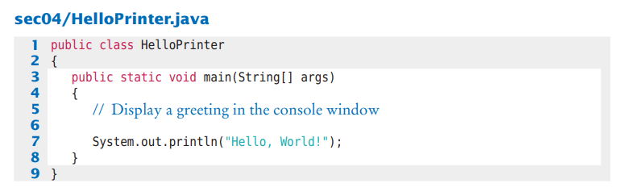

Garis
public class HelloPrinter
menunjukkan deklarasi kelas yang disebut HelloPrinter.
Setiap program Java terdiri dari satu atau lebih kelas. Kami akan membahas kelas lebih lanjut
rinci dalam Bab 2 dan 3.
Kata publik menunjukkan bahwa kelas dapat digunakan oleh "publik". Anda akan nanti
menemukan fitur pribadi.
Di Java, setiap file sumber dapat berisi paling banyak satu public class, dan nama dari
public class harus cocok dengan nama file yang berisi kelas tersebut. Misalnya,
kelas HelloPrinter harus terdapat dalam sebuah file bernama HelloPrinter.java.
Konstruksi
public static void main(String[] args)
{
 . . .
}
mendeklarasikan metode yang disebut main. Sebuah metode berisi kumpulan pemrograman
instruksi yang menjelaskan bagaimana melaksanakan tugas tertentu.
Setiap aplikasi Java harus memiliki metode utama. Sebagian besar program Java berisi:
metode lain selain utama, dan Anda akan melihat di Bab 3 cara menulis other
metode.
Istilah statis dijelaskan secara lebih rinci dalam Bab 8, dan arti dari
String[] args dibahas dalam Bab 11. Saat ini, cukup pertimbangkan

public class ClassName
{

 public static void main(String[] args)

 {

 . . .

 }

}

sebagai bagian dari "pipa" yang diperlukan untuk membuat program Java. Program pertama kami memiliki semua instruksi di dalam metode utama kelas.
Metode utama berisi satu atau lebih instruksi yang disebut pernyataan. Setiap statemen diakhiri dengan titik koma (;). Ketika sebuah program berjalan, pernyataan dalam metode utama
dijalankan satu per satu.

Dalam program contoh kami, metode utama memiliki satu pernyataan:

System.out.println("Halo, Dunia!");

Pernyataan ini mencetak sebaris teks, yaitu “Halo, Dunia!”. Dalam pernyataan ini, kami menyebut
metode yang, untuk alasan yang tidak akan kami jelaskan di sini, ditentukan oleh
nama panjang System.out.println.
Kita tidak harus mengimplementasikan metode ini—programmer yang menulis Java
perpustakaan sudah melakukannya untuk kita. Kami hanya ingin metode untuk melakukan yang dimaksudkan
tugas, yaitu mencetak nilai.
Setiap kali Anda memanggil metode di Java, Anda perlu menentukan
1. Metode yang ingin Anda gunakan (dalam hal ini, System.out.println).
2. Nilai apa pun yang dibutuhkan metode untuk menjalankan tugasnya (dalam hal ini, "Halo, Dunia!").
Istilah teknis untuk nilai seperti itu adalah argumen. Argumen terlampir dalam
tanda kurung. Beberapa argumen dipisahkan dengan koma.

Urutan karakter yang diapit tanda kutip

"Halo Dunia!"

disebut string. Anda harus menyertakan isi string di dalam tanda kutip
sehingga kompiler mengetahui maksud Anda secara harfiah "Halo, Dunia!". Ada alasan untuk
persyaratan ini. Misalkan Anda perlu mencetak kata main. Dengan melampirkannya dalam tanda kutip, "utama", kompiler tahu maksud Anda urutan karakter m a i n,
bukan metode bernama main. Aturannya sederhana, Anda harus menyertakan semua string teks di
tanda kutip, sehingga kompiler menganggapnya sebagai teks biasa dan tidak mencoba
menafsirkannya sebagai instruksi program.

Anda juga dapat mencetak nilai numerik. Misalnya pernyataan

System.out.println(3 + 4);

mengevaluasi ekspresi 3 + 4 dan menampilkan angka 7.

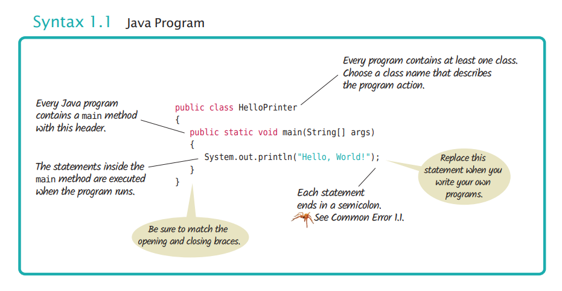

Metode System.out.println mencetak string atau angka dan kemudian memulai yang baru
garis. Misalnya, urutan pernyataan

System.out.println("Halo");

System.out.println("Dunia!");

mencetak dua baris teks:

Halo

Dunia!

Ada metode kedua, System.out.print, yang dapat Anda gunakan untuk mencetak item tanpa
memulai baris baru. Misalnya, output dari dua pernyataan

System.out.print("00");

System.out.println(3 + 4);

adalah garis tunggal

007

#### Menghilangkan Titik Koma

Di Java setiap pernyataan harus diakhiri dengan titik koma. Lupa mengetik titik koma adalah hal biasa
kesalahan. Ini membingungkan kompiler, karena kompiler menggunakan titik koma untuk menemukan di mana satu
pernyataan berakhir dan pernyataan berikutnya dimulai. Kompiler tidak menggunakan jeda baris atau kurung kurawal
untuk mengenali akhir pernyataan. Misalnya, kompiler menganggap

System.out.println("Halo")

System.out.println("Dunia!");

satu pernyataan, seolah-olah Anda telah menulis

System.out.println("Halo") System.

out.println("Dunia!");

Kemudian tidak mengerti pernyataan itu, karena tidak mengharapkan kata Sistem mengikuti kurung penutup setelah "Halo".
Obatnya sederhana. Pindai setiap pernyataan untuk tanda titik koma, seperti yang Anda lakukan
periksa apakah setiap kalimat bahasa Inggris diakhiri dengan tanda titik. Namun, jangan tambahkan titik koma di
akhir public class Halo atau public static void main. Garis-garis ini bukan pernyataan.

## 1.6 Kesalahan

Bereksperimenlah sedikit dengan program HelloPrinter. Apa yang terjadi jika Anda mengetik?
kesalahan seperti

System.ou.println("Halo, Dunia!");

System.out.println("Halo, Word!");

Dalam kasus pertama, kompiler akan mengeluh. Ini akan mengatakan bahwa ia tidak tahu apa yang Anda
maksudmu. Kata-kata yang tepat dari pesan kesalahan tergantung pada lingkungan pengembangan Anda, tetapi mungkin seperti "Tidak dapat menemukan simbol ou". Ini adalah sebuah
kesalahan waktu kompilasi. Ada yang salah menurut aturan bahasa dan
kompiler menemukannya. Untuk alasan ini, kesalahan waktu kompilasi sering disebut sintaks
kesalahan. Ketika kompiler menemukan satu atau lebih kesalahan, ia menolak untuk menerjemahkan

memprogram ke dalam instruksi mesin virtual Java, dan sebagai akibatnya Anda tidak
program yang dapat Anda jalankan. Anda harus memperbaiki kesalahan dan mengkompilasi lagi. Faktanya, kompiler cukup pilih-pilih, dan biasanya melewati beberapa putaran untuk memperbaiki kesalahan waktu kompilasi sebelum kompilasi berhasil untuk pertama kalinya.
Jika kompiler menemukan kesalahan, itu tidak akan hanya
berhenti dan menyerah. Ini akan mencoba melaporkan sebanyak mungkin
kesalahan seperti yang dapat ditemukan, sehingga Anda dapat memperbaiki semuanya sekaligus.
Terkadang, kesalahan melempar kompiler
keluar dari jalur. Misalkan, misalnya, Anda lupa
tanda kutip di sekitar string: System.out.
println(Halo, Dunia!). Kompiler tidak akan
mengeluh tentang tanda kutip yang hilang.
Sebagai gantinya, itu akan melaporkan "Tidak dapat menemukan simbol"
Halo". Sayangnya, kompilernya tidak terlalu
pintar dan tidak menyadari bahwa Anda bermaksud
menggunakan tali. Terserah Anda untuk menyadari bahwa Anda
perlu menyertakan string dalam tanda kutip.
Kesalahan pada baris kedua di atas adalah jenis yang berbeda. Program akan dikompilasi dan dijalankan,
tetapi outputnya akan salah. Ini akan mencetak

Halo, Kata!

Ini adalah kesalahan run-time. Program ini secara sintaksis benar dan melakukan sesuatu,
tetapi tidak melakukan apa yang seharusnya dilakukan. Karena kesalahan run-time disebabkan oleh
kelemahan logis dalam program, mereka sering disebut kesalahan logika.
Kesalahan run-time khusus ini tidak menyertakan pesan kesalahan. Itu hanya menghasilkan output yang salah. Beberapa jenis kesalahan run-time sangat parah sehingga menghasilkan pengecualian: pesan kesalahan dari mesin virtual Java. Misalnya, jika
program Anda menyertakan pernyataan

System.out.println(1 / 0);

Anda akan mendapatkan pesan kesalahan run-time "Pembagian dengan nol".
Selama pengembangan program, kesalahan tidak dapat dihindari. Setelah program lebih lama
dari beberapa baris, itu akan membutuhkan konsentrasi manusia super untuk memasukkannya dengan benar
tanpa tergelincir sekali. Anda akan menemukan diri Anda menghilangkan titik koma atau kutipan
menandai lebih sering daripada yang Anda inginkan, tetapi kompilator akan melacak masalah ini untuk Anda.
Kesalahan run-time lebih merepotkan. Kompiler tidak akan menemukannya—bahkan,
kompiler akan dengan senang hati menerjemahkan program apa pun selama sintaksnya benar—
tetapi program yang dihasilkan akan melakukan sesuatu yang salah. Ini adalah tanggung jawab
pembuat program untuk menguji program dan menemukan kesalahan run-time.

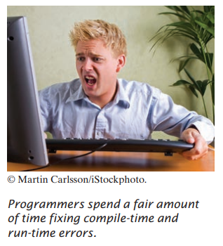

#### Kata-kata yang salah eja

Jika Anda secara tidak sengaja salah mengeja kata, maka hal-hal aneh mungkin terjadi, dan itu mungkin tidak selalu
benar-benar jelas dari pesan kesalahan apa yang salah. Berikut adalah contoh yang bagus tentang caranya
kesalahan ejaan sederhana dapat menyebabkan masalah: 

public class HelloPrinter
{

 public static void Main(String[] args)
 {

 System.out.println("Halo, Dunia!");
 }

}

Kelas ini mendeklarasikan sebuah metode yang disebut Main. Kompiler tidak akan menganggap ini sama dengan
metode main, karena Main dimulai dengan huruf besar dan bahasa Java peka huruf besar-kecil. Huruf besar dan huruf kecil dianggap benar-benar berbeda satu sama lain,
dan untuk kompiler Main tidak lebih cocok untuk main daripada rain. Kompiler akan dengan senang hati
kompilasi metode Utama Anda, tetapi ketika mesin virtual Java membaca file yang dikompilasi, itu akan
mengeluh tentang metode utama yang hilang dan menolak untuk menjalankan program. Tentu saja, pesan "metode utama yang hilang" akan memberi Anda petunjuk di mana mencari kesalahan.
Jika Anda mendapatkan pesan kesalahan yang tampaknya menunjukkan bahwa kompiler atau mesin virtual aktif
trek yang salah, periksa ejaan dan kapitalisasi. Jika Anda salah mengeja nama simbol
(misalnya, ou alih-alih keluar), kompiler akan menghasilkan pesan seperti "tidak dapat menemukan sym bol ou". Pesan kesalahan itu biasanya merupakan petunjuk bagus bahwa Anda membuat kesalahan ejaan.

## 1.7 Pemecahan Masalah: Desain Algoritma
Anda akan segera belajar bagaimana memprogram perhitungan dan pengambilan keputusan di Java. Tetapi
sebelum kita melihat mekanisme penerapan perhitungan di bab berikutnya,
mari kita pertimbangkan bagaimana Anda dapat menjelaskan langkah-langkah yang diperlukan untuk menemukan solusi dari suatu masalah.
### 1.7.1 Konsep Algoritma
Anda mungkin pernah melihat iklan yang
mendorong Anda untuk membayar layanan komputerisasi
yang cocok Anda up dengan pasangan cinta. Memikirkan
bagaimana ini bisa berhasil. Anda mengisi formulir dan
kirimkan. Yang lain melakukan hal yang sama. Data diproses oleh program komputer. Apakah masuk akal untuk
asumsikan bahwa komputer dapat melakukan tugas
menemukan pasangan terbaik untuk Anda? Misalkan Anda
adik laki-laki, bukan komputer, memiliki semua
formulir di mejanya. Instruksi apa yang bisa Anda berikan?
memberinya? Anda tidak bisa mengatakan, “Temukan yang paling tampan
orang yang suka inline skating dan browsing
internet”. Tidak ada standar objektif untuk
ketampanan, dan pendapat saudaramu (atau itu
program komputer yang menganalisis foto calon mitra) kemungkinan akan
berbeda dari milikmu. Jika Anda tidak dapat memberikan instruksi tertulis kepada seseorang untuk menyelesaikannya
masalah, tidak mungkin komputer secara ajaib dapat menemukan solusi yang tepat. Itu
komputer hanya dapat melakukan apa yang Anda perintahkan. Itu hanya melakukannya lebih cepat, tanpa mendapatkan
bosan atau lelah.

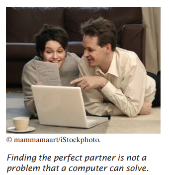

Oleh karena itu, layanan pembuatan jodoh yang terkomputerisasi tidak dapat menjamin untuk menemukan
pasangan yang optimal untuk Anda. Sebagai gantinya, Anda mungkin akan dihadapkan pada sekumpulan calon mitra yang memiliki minat yang sama dengan Anda. Itu adalah tugas yang program komputer
dapat memecahkan.
Agar program komputer memberikan jawaban atas masalah yang menghitung
jawaban, itu harus mengikuti urutan langkah-langkah yang

• Jelas

• Dapat dijalankan

• Mengakhiri

Urutan langkah tidak ambigu ketika ada
instruksi yang tepat tentang apa yang harus dilakukan pada setiap langkah dan
kemana harus pergi selanjutnya. Tidak ada ruang untuk menebak
atau pendapat pribadi. Sebuah langkah dapat dieksekusi ketika itu
dapat dilaksanakan dalam praktek. Misalnya, komputer dapat mencantumkan semua orang yang memiliki hobi yang sama dengan Anda,
tetapi tidak dapat memprediksi siapa yang akan menjadi pasangan seumur hidup Anda. Akhirnya, urutan langkah berakhir jika
pada akhirnya akan berakhir. Sebuah program yang
terus bekerja tanpa memberikan jawaban adalah
jelas tidak berguna.
Urutan langkah yang tidak ambigu, dapat dieksekusi, dan diakhiri disebut algoritma.
Meskipun tidak ada algoritme untuk menemukan pasangan, banyak masalah memiliki algoritme untuk diselesaikan
mereka. Bagian berikutnya memberikan contoh.

### 1.7.2 Algoritma untuk Memecahkan Masalah Investasi
Pertimbangkan masalah investasi berikut:
Anda memasukkan $10.000 ke dalam rekening bank yang menghasilkan bunga 5 persen per tahun. Berapa banyak
tahun yang diperlukan agar saldo akun menjadi dua kali lipat dari aslinya?
Bisakah Anda memecahkan masalah ini dengan tangan? Tentu, Anda bisa. Anda mengetahui keseimbangannya
sebagai berikut:

Anda terus berjalan sampai saldo setidaknya $20.000. Kemudian angka terakhir di tahun ini
kolom adalah jawabannya.
Tentu saja, melakukan perhitungan ini sangat membosankan bagi Anda atau Anda
adik laki-laki. Tetapi komputer sangat baik dalam melakukan perhitungan berulang dengan cepat dan tanpa cacat. Yang penting bagi komputer adalah deskripsi dari langkah mencari solusi. Setiap langkah harus jelas dan tidak ambigu, tidak memerlukan
tebak-tebakan. Berikut adalah deskripsi seperti itu: 

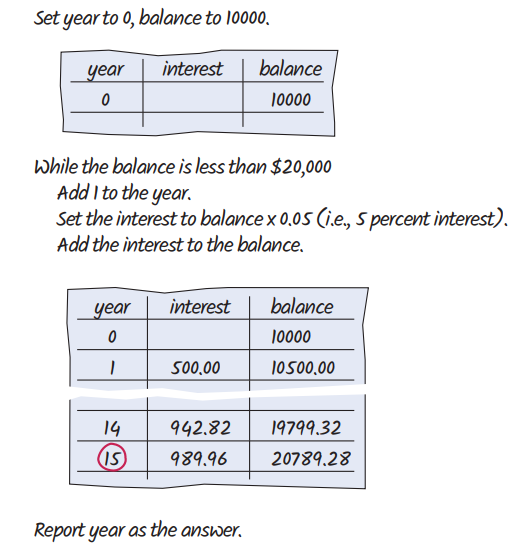

Langkah-langkah ini belum dalam bahasa yang dapat dipahami oleh komputer, tetapi Anda akan
segera pelajari cara merumuskannya di Jawa. Deskripsi informal ini disebut kode semu. Kami memeriksa aturan untuk menulis kodesemu di bagian selanjutnya.

### 1.7.3 Pseudocode

Tidak ada persyaratan ketat untuk pseudocode karena dibaca oleh pembaca manusia,
bukan program komputer. Berikut adalah jenis-jenis pernyataan pseudocode dan bagaimana kita:

akan menggunakannya dalam buku ini:
• Gunakan pernyataan seperti berikut ini untuk menjelaskan bagaimana suatu nilai ditetapkan atau diubah:

biaya total = harga beli + biaya operasi

Kalikan nilai saldo dengan 1,05.

Hapus karakter pertama dan terakhir dari kata.

• Jelaskan keputusan dan pengulangan sebagai berikut:

Jika total biaya 1 < total biaya 2

Sementara saldo kurang dari $20,000

Untuk setiap gambar dalam urutan

Gunakan lekukan untuk menunjukkan pernyataan mana yang harus dipilih atau diulang:

Untuk setiap mobil

  biaya operasi = 10 x biaya bahan bakar tahunan

  biaya total = harga beli + biaya operasi

Di sini, lekukan menunjukkan bahwa kedua pernyataan harus dieksekusi untuk
setiap mobil

• Indicate results with statements such as:

Choose car1.

Report year as the answer.

### 1.7.4 Dari Algoritma ke Program

Di Bagian 1.7.2, kami mengembangkan kodesemu untuk menemukan berapa lama waktu yang dibutuhkan untuk menggandakan
investasi. Mari kita periksa kembali bahwa pseudocode mewakili suatu algoritma; itu adalah,
bahwa itu tidak ambigu, dapat dieksekusi, dan diakhiri.
Pseudocode kami tidak ambigu. Ini hanya memberi tahu cara memperbarui nilai di setiap langkah.
Pseudocode dapat dieksekusi karena kami menggunakan tingkat bunga tetap. Apakah kami mengatakan untuk menggunakan
tingkat bunga aktual yang akan dibebankan di tahun-tahun mendatang, dan bukan tingkat bunga tetap 5
persen per tahun, instruksi tidak akan dapat dieksekusi. Tidak ada jalan
bagi siapa pun untuk mengetahui berapa tingkat bunga di masa depan. Ini membutuhkan sedikit
berpikir untuk melihat bahwa langkah-langkahnya berakhir: Dengan setiap langkah, keseimbangan naik
setidaknya $ 500, jadi akhirnya harus mencapai $ 20.000.
Oleh karena itu, kami telah menemukan algoritme untuk menyelesaikan masalah investasi kami, dan
kami tahu kami dapat menemukan solusinya dengan memprogram komputer. keberadaan
algoritma adalah prasyarat penting untuk memprogram tugas. Anda harus terlebih dahulu
temukan dan jelaskan algoritma untuk tugas sebelum Anda memulai pemrograman (lihat
Angka 8). Dalam bab-bab berikutnya, Anda akan mempelajari cara mengekspresikan algoritme dalam
bahasa Java.

# BAGAIMANA 1.1
# Menjelaskan algoritma dengan Pseudocode

Ini adalah yang pertama dari banyak cara bagian dalam buku ini yang memberikan Anda langkah-demi-langkah prosedur untuk melaksanakan tugas-tugas penting dalam mengembangkan program komputer.

Sebelum Anda siap untuk menulis sebuah program di Java, Anda perlu mengembangkan metode algorithma untuk tiba di solusi untuk masalah tertentu menggambarkan algoritma di pseudocode urutan langkah-langkah yang tepat dirumuskan dalam bahasa Inggris untuk menggambarkan, kami akan merancang sebuah algoritma untuk masalah ini:

Pernyataan masalah	 Anda memiliki pilihan untuk membeli salah satu dari dua mobil. Satu lebih hemat bahan bakar daripada yang lain, tetapi juga lebih mahal.

Anda tahu harga dan efisiensi bahan bakar (dalam mil per galon, mpg) dari kedua mobil. Anda berencana untuk menyimpan mobil selama sepuluh tahun. Asumsikan harga $4 per galon gas dan penggunaan 15.000 mil per tahun. Anda akan membayar tunai untuk mobil dan tidak khawatir tentang biaya pembiayaan. Mobil mana yang lebih baik?

1. Tentukan input dan output. 

Dalam contoh soal kami, kami memiliki input ini:
* **Harga beli 1** dan **efisiensi bahan bakar 1**, harga dan efisiensi bahan bakar (dalam mpg) mobil pertama.
* **Harga beli 2** dan **efisiensi bahan bakar 2**, harga dan efisiensi bahan bakar mobil kedua.
Kami hanya ingin tahu mobil mana yang lebih baik dibeli. Itu adalah keluaran (output) yang diinginkan.

2. Memecah masalah menjadi tugas-tugas yang lebih kecil. 

Untuk setiap mobil, kita perlu mengetahui total biaya mengemudinya. Mari kita lakukan perhitungan ini secara terpisah untuk setiap mobil. Setelah kita memiliki total biaya untuk setiap mobil, kita dapat memutuskan mobil mana yang lebih baik.

Total biaya untuk setiap mobil adalah **harga beli** + **biaya operasional**.

Kami mengasumsikan penggunaan konstan dan harga gas selama sepuluh tahun, sehingga biaya operasi tergantung pada biaya mengemudi mobil selama satu tahun.

Biaya operasi adalah 10 x biaya bahan bakar tahunan.

Biaya bahan bakar tahunan adalah harga per galon x bahan bakar tahunan yang dikonsumsi.

Bahan bakar tahunan yang dikonsumsi adalah jarak tempuh tahunan / efisiensi bahan bakar. Misalnya, jika Anda mengendarai mobil sejauh 15.000 mil dan efisiensi bahan bakarnya 15 mil/galon, mobil tersebut mengkonsumsi 1.000 galon.

3. Jelaskan setiap subtugas dalam pseudocode.

 
Dalam uraian Anda, atur langkah-langkahnya sehingga setiap nilai antara dihitung sebelum diperlukan dalam perhitungan lain. Misalnya, daftar langkah:

biaya total = harga pembelian + biaya operasi Setelah Anda menghitung biaya operasi.

Berikut adalah algoritma untuk memutuskan mobilmana yang akan dibeli:

Untuk setiap mobil, hitung total biaya sebagai berikut: 

konsumsi bahan bakar tahunan = jarak tempuh tahunan / efisiensi bahan bakar 

biaya bahan bakar tahunan = harga per galon x konsumsi bahan bakar tahunan 

biaya operasional = 10 x biaya bahan bakar tahunan 

total biaya = harga beli + biaya operasional 

Jika total biaya mobil1 < total biaya mobil2

Pilih mobil1. 

Lainnya

 Pilih mobil2.

4. Uji pseudocode Anda dengan mengerjakan soal.

Kami akan menggunakan nilai sampel ini: 

Mobil 1: $25.000, 50 mil/galon 

Mobil 2: $20.000, 30 mil/galon 

Berikut adalah perhitungan biaya mobil pertama:

konsumsi bahan bakar tahunan = jarak tempuh tahunan / efisiensi bahan bakar = 15000 / 50 = 300 

biaya bahan bakar tahunan = harga per galon x konsumsi bahan bakar tahunan = 4 x 300 = 1200 

biaya operasi = 10 x biaya bahan bakar tahunan = 10 x 1200 = 12000 

total biaya = harga pembelian + biaya operasi = 25000 + 12000 = 37000 

Demikian pula, total biaya untuk mobil kedua adalah $ 40.000. Oleh karena itu, keluaran dari algoritma adalah memilih mobil 1.

Contoh Kerja berikut menunjukkan bagaimana menggunakan konsep-konsep dalam bab ini dan langkah-langkah dalam Cara untuk memecahkan masalah lain. Dalam hal ini, Anda akan melihat bagaimana mengembangkan algoritme untuk meletakkan ubin dalam pola warna yang bergantian. Anda harus membaca Contoh yang Dikerjakan untuk meninjau apa yang telah Anda pelajari, dan untuk bantuan dalam mengatasi masalah lain.

Di bab-bab selanjutnya, contoh yang dikerjakan ditunjukkan dengan deskripsi singkat tentang masalah yang ditangani dalam contoh, ditambah pengingat untuk melihatnya di eTeks Anda atau mengunduhnya dari situs web pendamping buku di www.wiley.com/go/bjeo7. Anda akan menemukan kode apa pun yang terkait dengan Contoh yang Dikerjakan yang disertakan dengan kode pendamping buku untuk bab ini. Saat Anda melihat deskripsi Contoh yang Dikerjakan, buka contoh dan lihat dan jalankan kode untuk mempelajari bagaimana masalah tersebut diselesaikan.

**CONTOH YANG BERHASIL 1.1**

**Menulis Sebuah Algoritma untuk Memasang Ubin Lantai**

**Rumusan Masalah** Tulis sebuah algoritma untuk memasang ubin lantai kamar mandi persegi panjang dengan ubin hitam putih berselang-seling berukuran 4×4 inci. Dimensi lantai, diukur dalam inci, dengan kelipatan 4.

1. Tentukan input dan outputnya. Inputnya merupakan dimensi lantai (panjang × lebar), diukur dengan inci. Outputnya merupakan lantai keramik.

2. Pecah masalah ke dalam tugas-tugas kecil. Subtugas natural yaitu membuat satu baris ubin. Jika kamu bisa selesaikan tugas itu, maka kamu dapat menyelesaikan masalah dengan membuat satu baris di samping yang lain, mulai dari dinding, hingga kamu mencapai dinding yang berlawanan.

3. Bagaimana cara membuat baris tersebut? Mulailah dengan ubin di satu dinding. Jika tersebut berwarna putih, letakkan yang hitam di sebelahnya. Jika berwarna hitam, taruh ubin putih di sebelahnya. Terus lakukan hal tersebut hingga kamu mencapai dinding yang berlawanan. Baris akan berisi lebar / 4 ubin.

4. Jelaskan setiap tugas ke dalam pseudocode (kodesemu). Dalam kodesemu, kamu ingin lebih tepat tentang di mana tepatnya ubin ditempatkan.
Tempatkan ubin hitam di sudut barat laut Sementara lantai belum terisi
Ulangi lebar / 4 – 1 kali
Tempatkan ubin di sebelah timur ubin yang ditempatkan sebelumnya. Jika ubin yang ditempatkan sebelumnya berwarna putih, pilih yang hitam; jika tidak, pilih yang putih.
Kembali pada ubin di awal baris yang baru saja kamu tempatkan. Jika ada
ruang di selatan, letakkan ubin dengan warna yang berlawanan di bawahnya.

5. Uji kodesemu dengan mengerjakan suatu masalah. Misalkan kamu ingin memasang ubin di area berukuran 20 × 12 inci. Langkah pertama adalah menempatkan ubin hitam di sudut barat laut.

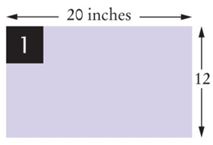

Selanjutnya, tempatkan empat ubin secara bergantian hingga mencapai dinding timur. (lebar / 4 – 1 = 20 / 4 – 1 = 4).

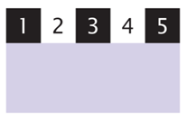

Ada ruang di selatan. Kembali pada ubin di awal baris yang sudah selesai. Warnanya hitam. Tempatkan ubin putih di sebelah selatannya.

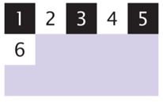

Lengkapi baris.

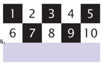

Masih ada ruang di selatan. Kembali pada ubin di awal baris yang sudah selesai. Warnanya putih. Tempatkan ubin hitam di selatannya.

Lengkapi baris.

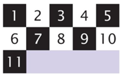

Sekarang seluruh lantai terisi dan selesai.

## RINGKASAN BAB

Mendefinisikan "program komputer" dan pemrograman
* Komputer menjalankan instruksi yang sangat mendasar secara berurutan.
* Program komputer adalah urutan instruksi dan keputusan.
* Pemrograman adalah tindakan merancang dan mengimplementasikan program komputer.

* Unit pemrosesan pusat (CPU) melakukan kontrol program dan data.
* Perangkat penyimpanan termasuk memori dan penyimpanan sekunder.

Penjelasan komponen-komponen komputer

Penjelasan proses penerjemahan bahasa tingkat tinggi ke kode mesin
* Java awalnya dirancang untuk memprogram perangkat konsumen, tetapi pertama kali berhasil digunakan untuk menulis applet internet.
* Java dirancang agar aman dan portabel, bermanfaat bagi pengguna internet dan pelajar.
* Program java didistribusikan sebagai instruksi untuk mesin virtual, menjadikannya platform-independen.
* Java memiliki perpustakaan yang sangat besar, fokuslah untuk mempelajari bagian- bagian perpustakaan yang Anda butuhkan untuk proyek pemrograman Anda.

Menjadi akrab dengan lingkungan pemrograman java Anda
* Luangkan waktu untuk membiasakan diri dengan lingkungan pemrograman yang akan Anda gunakan untuk tugas kelas Anda.
* Editor adalah program untuk memasukkan dan memodifikasi teks, seperti program java.
* Java peka huruf besar-kecil, Anda harus berhati-hati dalam membedakan antara huruf besar dan huruf kecil.
* Kompiler java menerjemahkan kode sumber ke dalam file kelas yang berisi instruksi untuk mesin virtual java.
* Mengembangkan strategi untuk menyimpan salinan cadangan pekerjaan Anda sebelum masalah terjadi.

Menggambarkan blok bangunan dari program sederhana
* Kelas adalah blok bangunan dasar dari program java.
* Setiap aplikasi java berisi kelas dengan metode utama, ketika bintang aplikasi, instruksi dalam metode utama dijalankan.
* Setiap kelas berisi deklarasi metode, setiap metode berisi urutan instruksi.
* Sebuah metode dipanggil dengan menentukan metode dan argumennya.
* String adalah urutan karakter yang diapit tanda kutip.

Mengklasifikasikan kesalahan program sebagai kompilasi - kesalahan waktu dan waktu berjalan
* Kesalahan waktu kompilasi adalah pelanggaran aturan bahasa pemrograman yang dideteksi oleh kompiler.
* Kesalahan run waktu berjalan menyebabkan program mengambil tindakan yang tidak diinginkan oleh programmer.

Tulis kode semu untuk algoritma sederhana
* Algoritma untuk memecahkan masalah adalah urutan langkah yang jelas dapat dieksekusi dan diakhiri.
* Kode semu adalah deskripsi informal dari urutan langkah-langkah untuk memecahkan masalah.

## ITEM PERPUSTAKAAN STANDAR YANG DIPERKENALKAN DALAM BAB INI
java.io.PrintStream java.lang.System print out println